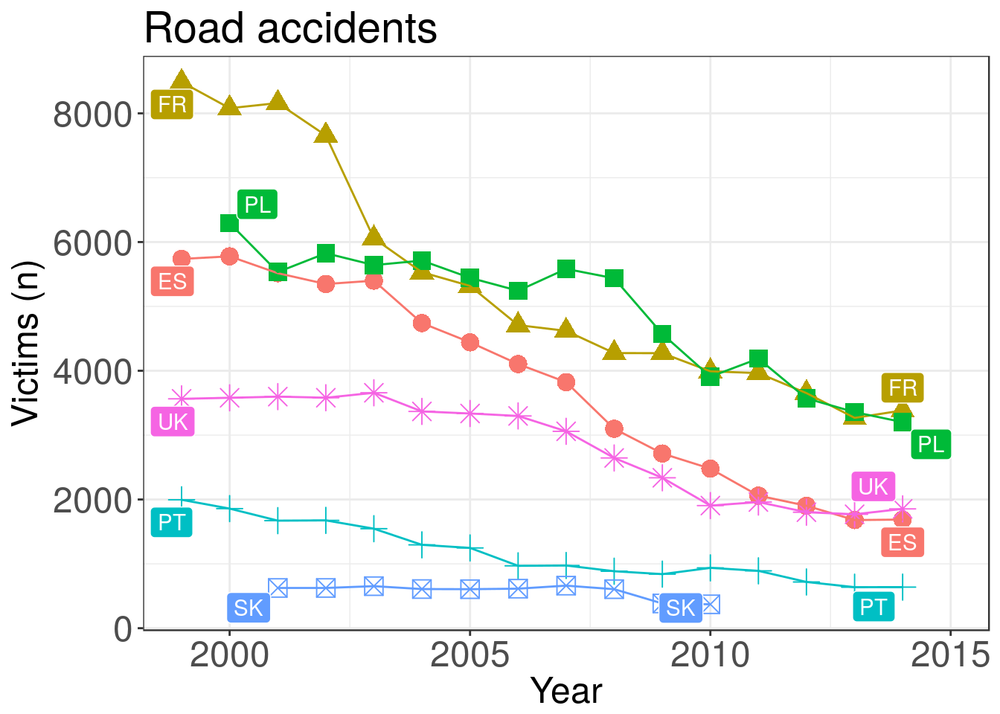
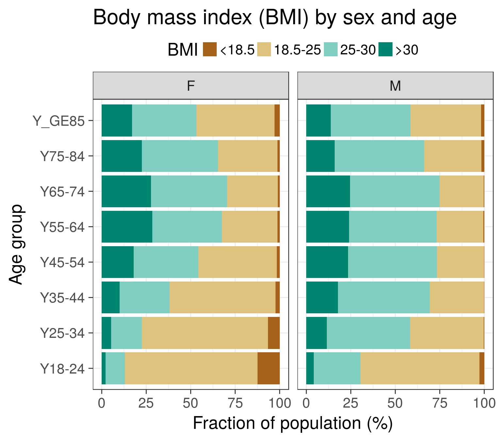
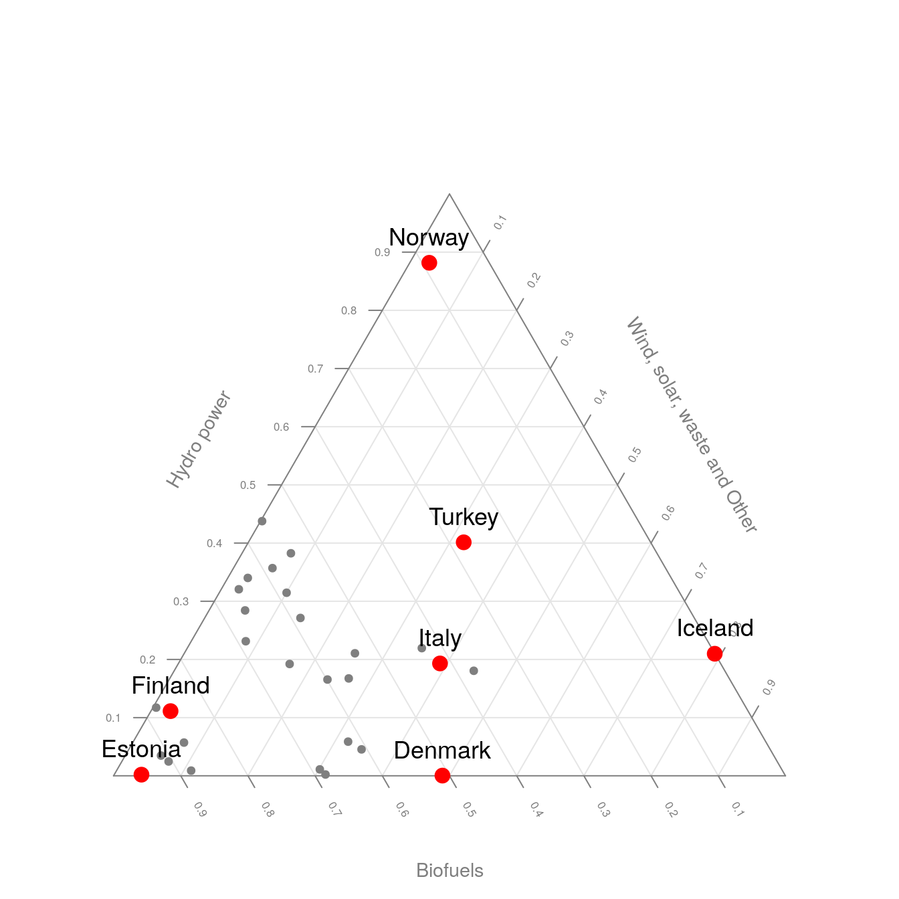
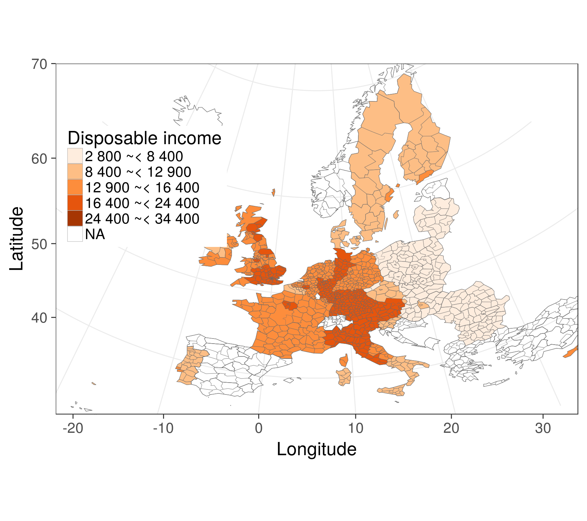

<!--
%\VignetteEngine{knitr::rmarkdown}
%\VignetteIndexEntry{eurostat Markdown Vignette}
%\usepackage[utf8]{inputenc}
-->
This document reproduces the figures and tables in [our manuscript (in preparation)](RJwrapper.pdf) on the [eurostat R package](https://github.com/rOpenGov/eurostat), assuming that the required R extensions have been installed. For detailed explanation of the examples, see the manuscript text.

To reproduce the complete manuscript PDF, clone this [repository](https://github.com/rOpenGov/eurostat), navigate to the [./vignettes/2015-RJournal](https://github.com/rOpenGov/eurostat/tree/master/vignettes/2015-RJournal) subdirectory and convert the [Rmarkdown source code](lahti-huovari-kainu-biecek.Rmd) in R by navigating to the [vignettes/2015-RJournal](https://github.com/rOpenGov/eurostat/blob/master/vignettes/2015-RJournal/) folder, and running in R:

``` r
source("main.R")
```

Alternatively, you can proceed in steps as follows. Generate this markdown page with manuscript figures (PNG) with:

``` r
library(knitr)
knit("lahti-huovari-kainu-biecek.Rmd")
```

This will run the following workflow.

``` r
# Load the required R packages
library(eurostat)
library(knitr)
library(xtable)
library(tidyr)
library(dplyr)
library(plotrix)
library(ggplot2)

# Set ggplot theme
theme_set(theme_bw(20))

# Set figure folder
knitr::opts_chunk$set(fig.path = "./")
```

Installation
------------

Installing the CRAN release version:

``` r
install.packages("eurostat")
```

Installing the Github development version:

``` r
library(devtools)
install_github("ropengov/eurostat")
```

We also recommend setting the UTF-8 encoding:

``` r
Sys.setlocale(locale="UTF-8") 
```

    ## [1] ""

Search and download
-------------------

To retrieve data for 'road accidents', for instance, use:

``` r
library(eurostat)
query <- search_eurostat("road accidents", type = "table")
```

Investigate the first entry of our query:

``` r
query$code[[1]]
```

    ## NULL

``` r
query$title[[1]]
```

    ## NULL

To retrieve the data set with this identifier, use:

``` r
dat <- get_eurostat(id = "tsdtr420", time_format = "num")
```

This produces a table:

``` r
kable(head(dat))
```

| unit | sex | geo |  time|  values|
|:-----|:----|:----|-----:|-------:|
| NR   | T   | AT  |  1999|    1079|
| NR   | T   | BE  |  1999|    1397|
| NR   | T   | CZ  |  1999|    1455|
| NR   | T   | DE  |  1999|    7772|
| NR   | T   | DK  |  1999|     514|
| NR   | T   | EL  |  1999|    2116|

Convert to human-readable labels:

``` r
# Convert into human readable labels
datl <- label_eurostat(dat)
kable(head(datl))
```

| unit   | sex   | geo                                              |  time|  values|
|:-------|:------|:-------------------------------------------------|-----:|-------:|
| Number | Total | Austria                                          |  1999|    1079|
| Number | Total | Belgium                                          |  1999|    1397|
| Number | Total | Czech Republic                                   |  1999|    1455|
| Number | Total | Germany (until 1990 former territory of the FRG) |  1999|    7772|
| Number | Total | Denmark                                          |  1999|     514|
| Number | Total | Greece                                           |  1999|    2116|

Road accidents
--------------

The original and more detailed treatment of this example is provided in a [blog post](http://pbiecek.github.io/archivist/justGetIT.html).

``` r
t1 <- get_eurostat("tsdtr420", 
  filters = list(geo = c("UK", "SK", "FR", "PL", "ES", "PT"))) 

ggplot(t1, aes(x = time, y = values, color=geo, group=geo, shape=geo)) +
  geom_point(size=4) + 
  geom_line() + theme_bw() + ggtitle("Road accidents")+
  xlab("Year") + ylab("Victims (n)") +
  # labels
  theme(legend.position="none") +
  ggrepel::geom_label_repel(data=t1 %>%  
                     group_by(geo) %>% 
                     na.omit() %>% 
                     filter(time %in% c(min(time),max(time))),
                   aes(fill=geo,label=geo),color="white")
```



Body-mass index
---------------

``` r
library(dplyr)
tmp1 <- get_eurostat("hlth_ehis_de1", time_format = "raw")
tmp1 %>%
  dplyr::filter( isced97 == "TOTAL" ,
          sex != "T",
          age != "TOTAL", geo == "PL") %>%
  mutate(BMI = factor(bmi, 
                      levels=c("LT18P5","18P5-25","25-30","GE30"), 
                      labels=c("<18.5", "18.5-25", "25-30",">30"))) %>%
  arrange(BMI) %>%
  ggplot(aes(y=values, x=age, fill=BMI)) +
  geom_bar(stat="identity") +
  facet_wrap(~sex) + coord_flip() +
  theme(legend.position="top") +
  ggtitle("Body mass index (BMI) by sex and age") +
  xlab("Age group") +
  ylab("Fraction of population (%)") +  
  scale_fill_brewer(type = "div")
```



Renewable energy production
---------------------------

``` r
dict <- c("Solid biofuels (excluding charcoal)" = "Biofuels",
          "Biogasoline" = "Biofuels",
          "Other liquid biofuels" = "Biofuels",
          "Biodiesels" = "Biofuels",
          "Biogas" = "Biofuels",
          "Hydro power" = "Hydro power",
          "Tide, Wave and Ocean" = "Hydro power",
          "Solar thermal" = "Wind, solar, waste and Other",
          "Geothermal Energy" = "Wind, solar, waste and Other",
          "Solar photovoltaic" = "Wind, solar, waste and Other",
          "Municipal waste (renewable)" = "Wind, solar, waste and Other",
          "Wind power" = "Wind, solar, waste and Other",
          "Bio jet kerosene" = "Wind, solar, waste and Other")

energy3 <- get_eurostat("ten00081") %>%
  label_eurostat(dat) %>% 
  filter(time == "2013-01-01",
         product != "Renewable energies") %>%
  mutate(nproduct = dict[as.character(product)], # just three categories
         geo = gsub(geo, pattern=" \\(.*", replacement="")) %>%
  select(nproduct, geo, values) %>% 
  group_by(nproduct, geo) %>%
  summarise(svalue = sum(values)) %>%
  group_by(geo) %>%
  mutate(tvalue = sum(svalue),
         svalue = svalue/sum(svalue)) %>%
  filter(tvalue > 1000,
         !grepl(geo, pattern="^Euro")) %>% # only large countrie
  spread(nproduct, svalue)

par(cex=1.5)
plotrix::triax.plot(as.matrix(energy3[, c(3,5,4)]),
                      show.grid = TRUE,
                      label.points = TRUE, point.labels = energy3$geo,cex.ticks=0.75,col.symbols = "red4",
                      pch = 19)
```



Map visualization
-----------------

The source code for the detailed map visualization is hidden but [available](https://github.com/rOpenGov/eurostat/blob/master/vignettes/2015-RJournal/lahti-huovari-kainu-biecek.Rmd). For a detailed treatment of this example, see our [related blog post](http://ropengov.github.io/r/2015/05/01/eurostat-package-examples/).

``` r
library(eurostat)
library(dplyr)
library(ggplot2)
# Downloading and manipulating the tabular data
get_eurostat("tgs00026", time_format = "raw") %>% 
  # subsetting to year 2005 and NUTS-3 level
  dplyr::filter(time == 2005, nchar(as.character(geo)) == 4) %>% 
  # classifying the values the variable
  dplyr::mutate(`Disposable income` = cut_to_classes(values)) %>% 
  # merge Eurostat data with geodata from Cisco
  merge_eurostat_geodata(data=.,geocolumn="geo",resolution = "60", output_class ="df", all_regions=TRUE) %>% 
  # plot map
  ggplot(data=., aes(long,lat,group=group)) +
  geom_polygon(aes(fill = `Disposable income`), colour=alpha("dim grey", 1/2),size=.2) +
  scale_fill_manual(values=RColorBrewer::brewer.pal(n = 5, name = "Oranges")) + theme(legend.position=c(0.17,0.65)) +
  coord_map(project="orthographic", xlim=c(-22,34), ylim=c(35,70)) +
  xlab("Longitude") + ylab("Latitude")
```



Country code tables
-------------------

``` r
# Load EFTA country listing
data(efta_countries)

# Print the table
#print(xtable(efta_countries))
kable(efta_countries)
```

| code | name          |
|:-----|:--------------|
| IS   | Iceland       |
| LI   | Liechtenstein |
| NO   | Norway        |
| CH   | Switzerland   |

Contact
-------

For contact information, see the [README](../README.md).

Version info
------------

This tutorial was created with

``` r
sessionInfo()
```

    ## R version 3.3.1 (2016-06-21)
    ## Platform: x86_64-pc-linux-gnu (64-bit)
    ## Running under: Ubuntu 16.10
    ## 
    ## locale:
    ##  [1] LC_CTYPE=en_US.UTF-8       LC_NUMERIC=C              
    ##  [3] LC_TIME=en_US.UTF-8        LC_COLLATE=en_US.UTF-8    
    ##  [5] LC_MONETARY=en_US.UTF-8    LC_MESSAGES=en_US.UTF-8   
    ##  [7] LC_PAPER=en_US.UTF-8       LC_NAME=C                 
    ##  [9] LC_ADDRESS=C               LC_TELEPHONE=C            
    ## [11] LC_MEASUREMENT=en_US.UTF-8 LC_IDENTIFICATION=C       
    ## 
    ## attached base packages:
    ## [1] stats     graphics  grDevices utils     datasets  methods   base     
    ## 
    ## other attached packages:
    ## [1] rmarkdown_1.3.9004   ggplot2_2.2.1        plotrix_3.6-3       
    ## [4] dplyr_0.5.0          tidyr_0.6.1          xtable_1.8-2        
    ## [7] knitr_1.15.1         eurostat_2.3.20001   devtools_1.12.0.9000
    ## 
    ## loaded via a namespace (and not attached):
    ##  [1] Rcpp_0.12.9.4       highr_0.6           plyr_1.8.4         
    ##  [4] RColorBrewer_1.1-2  class_7.3-14        tools_3.3.1        
    ##  [7] testthat_1.0.2      digest_0.6.12       pkgbuild_0.0.0.9000
    ## [10] pkgload_0.0.0.9000  jsonlite_1.3        memoise_1.0.0      
    ## [13] evaluate_0.10       tibble_1.2          gtable_0.2.0       
    ## [16] lattice_0.20-34     DBI_0.5-1           mapproj_1.2-4      
    ## [19] commonmark_1.2      yaml_2.1.14         ggrepel_0.6.5      
    ## [22] curl_2.3            e1071_1.6-7         withr_1.0.2        
    ## [25] httr_1.2.1          stringr_1.2.0       roxygen2_6.0.1     
    ## [28] xml2_1.1.1          maps_3.1.1          classInt_0.1-23    
    ## [31] rprojroot_1.2       grid_3.3.1          R6_2.2.0           
    ## [34] sp_1.2-3            readr_1.0.0         magrittr_1.5       
    ## [37] htmltools_0.3.5     scales_0.4.1        backports_1.0.5    
    ## [40] assertthat_0.1      colorspace_1.3-2    labeling_0.3       
    ## [43] stringi_1.1.3       lazyeval_0.2.0      munsell_0.4.3      
    ## [46] crayon_1.3.2
